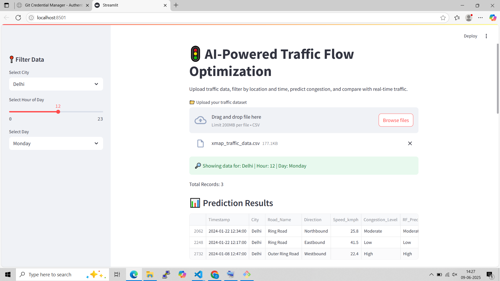
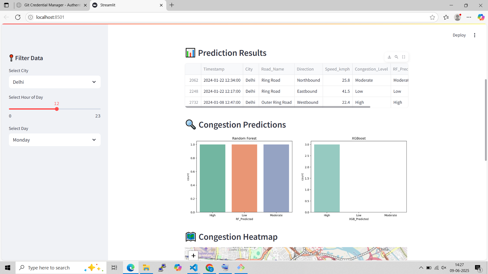
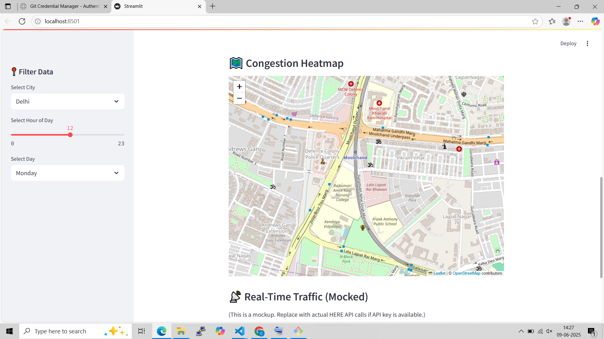
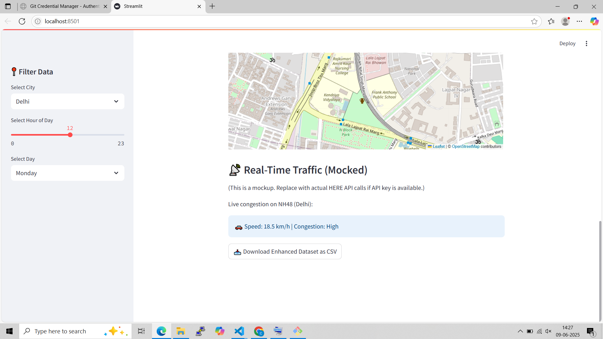

# 🚦 AI-Powered Traffic Flow Optimizer

🧠 **Live App**: [Click here to try it](https://traffic-flow-optimizer-akshat.streamlit.app)

An AI-powered ML that project uses real-world traffic data to predict congestion levels using Random Forest and XGBoost, and displays results interactively using Streamlit and Folium. It leverages historical and real-time data to help optimize traffic flow and improve urban mobility.

[](https://traffic-flow-optimizer-akshat.streamlit.app)

---

## 📊 Features

- Predicts congestion levels using trained ML models.
- Built with Streamlit for an interactive dashboard.
- Filtering by city, time, and day of the week.
- Visualizes congestion patterns and flow heatmaps.

---

🧠 Models Used
Random Forest Regressor
XGBoost Regressor

## 📷 Output Screenshots

Here are some screenshots of the Traffic Analyzer app in action:

### 🖥️ Dashboard View


### 📈 Congestion Prediction


### 🌍 Map-Based Visualization


### 🖥️ Summary



## 🔧 How to Run the App

1. Clone this repository:

   ```bash
   git clone https://github.com/your-username/Traffic-Analyzer.git


2. Navigate to the project directory: cd Traffic-Analyzer

3. Install the required dependencies: pip install -r requirements.txt

4. Run the Streamlit app: streamlit run app/streamlit_app.py

